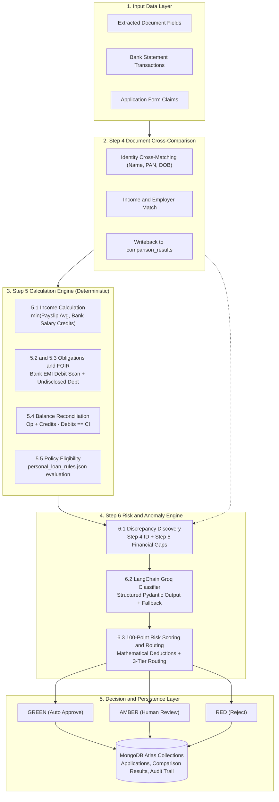

# 📘 TRACE — Underwriting Decision, Document Comparison & Risk Engine
## Complete Technical Handover & Operational User Guide

---

## 📑 Table of Contents

1. [System Overview & Architecture Philosophy](#1-system-overview--architecture-philosophy)
2. [Prerequisites & Environment Setup](#2-prerequisites--environment-setup)
3. [Database Architecture & Schema Reference](#3-database-architecture--schema-reference)
4. [Step 4: Document Cross-Comparison Engine Deep-Dive](#4-step-4-document-cross-comparison-engine-deep-dive)
5. [Step 5: Deterministic Calculation Engine Deep-Dive](#5-step-5-deterministic-calculation-engine-deep-dive)
6. [Step 6: Risk, Anomaly & Routing Engine Deep-Dive](#6-step-6-risk-anomaly--routing-engine-deep-dive)
7. [Operational Execution Guide (All Modes of Running)](#7-operational-execution-guide-all-modes-of-running)
8. [Automated Test Suite & Verification](#8-automated-test-suite--verification)
9. [Policy Configuration & Customization](#9-policy-configuration--customization)
10. [MongoDB Atlas Writeback & Audit Trail Specifications](#10-mongodb-atlas-writeback--audit-trail-specifications)
11. [Troubleshooting & Maintenance FAQ](#11-troubleshooting--maintenance-faq)
12. [Assessment Panel & Viva Defense Guide](#12-assessment-panel--viva-defense-guide)

---

## 1. System Overview & Architecture Philosophy

This module implements the complete decisioning core of the **TRACE Loan Document Processing Platform**:
- **Step 4:** Document Cross-Comparison & Identity Verification Engine
- **Step 5:** Deterministic Financial Calculation & Policy Eligibility Engine
- **Step 6:** Risk Scoring, GenAI Anomaly Assessment & 3-Tier Routing Engine

### 🛡️ The Architectural Guarantee: Zero Math Hallucinations
In loan underwriting, allowing a Large Language Model (LLM) to perform arithmetic or make autonomous approval decisions introduces severe risks of calculation errors, non-deterministic outputs, and regulatory non-compliance.

TRACE enforces a strict **separation of concerns**:
- **Deterministic Python Engine:** Performs 100% of identity comparisons, financial calculations (income averaging, bank salary resolution, obligation summation, loan stacking gap calculation, statement balance reconciliation, policy eligibility checks, mathematical point deductions, and 3-tier traffic-light routing).
- **Intelligent GenAI Layer:** Leverages `ChatGroq` (`openai/gpt-oss-20b` or `llama-3.3-70b-versatile`) strictly to analyze pre-detected discrepancies, assign contextual severity (`Minor`, `Moderate`, `Major`), perform semantic entity matching, and synthesize human-readable underwriting summaries.
- **Zero-Downtime Fallback:** If the LLM API is unavailable, rate-limited, or times out, a deterministic rule-based classifier engages automatically so the pipeline never halts.




---

## 2. Prerequisites & Environment Setup

### 2.1 System Prerequisites
- **Python:** `3.10`, `3.11`, or `3.12`
- **Database:** MongoDB Atlas instance (or local MongoDB 6.0+)
- **LLM API Key:** [Groq Cloud](https://console.groq.com) API Key (or Google Gemini API Key)

### 2.2 Installation Steps

1. **Navigate to the Project Directory:**
   ```bash
   cd "My Part"
   ```


2. **Create and Activate a Virtual Environment:**
   ```bash
   # Windows (PowerShell)
   python -m venv .venv
   .\.venv\Scripts\Activate.ps1

   # Linux / macOS
   python3 -m venv .venv
   source .venv/bin/activate
   ```

3. **Install Dependencies:**
   ```bash
   pip install -r requirements.txt
   ```

4. **Configure Environment Variables (`.env`):**
   Create a `.env` file in the root of the project:
   ```env
   # MongoDB Atlas Connection
   MONGO_URI=mongodb+srv://<username>:<password>@cluster0.cxry4fs.mongodb.net/trace_db?retryWrites=true&w=majority
   MONGO_DB=trace_db

   # Groq API Key (for Step 6.2 Anomaly Classification & Step 4 Semantic Matching)
   GROQ_API_KEY=gsk_your_groq_api_key_here

   # Gemini API Key (Optional secondary provider)
   GEMINI_API_KEY=AQ_your_gemini_api_key_here
   ```

5. **Verify Database Connectivity:**
   ```bash
   python -m unittest tests.test_db
   ```

---

## 3. Database Architecture & Schema Reference

The system interacts with **6 collections** within MongoDB Atlas:

```
trace_db/
├── applications         # Master loan application state, applicant info, financials, risk, routing, step4_comparison
├── comparison_results   # Standalone Step 4 document comparison records & field-level diffs
├── extracted_fields     # Field-level extracted values with bounding box & confidence evidence
├── bank_transactions    # Individual bank credit/debit records with categorization tags
├── audit_logs           # Immutable chronological audit trail of all engine actions
└── policy_embeddings    # RAG vector chunks for policy documents
```

### 3.1 Collection Schemas

#### 1. `applications` Collection
```json
{
  "_id": ObjectId("..."),
  "application_ref": "P003",
  "loan_type": "personal_loan",
  "status": "approved", // "pending" | "approved" | "review" | "rejected"
  "routing": {
    "color": "green", // "green" | "amber" | "red"
    "reason": "Fast-track: all checks passed, no discrepancies. Recommended for expedited approver sign-off."
  },
  "risk": {
    "score": 100.0,
    "grade": "Low", // "Low" (≥80) | "Moderate" (50-79) | "High" (<50)
    "recommendation": "recommend_approve", // "recommend_approve" | "recommend_review" | "recommend_reject"
    "requires_human_signoff": true, // Structurally enforced human-in-the-loop guarantee
    "reviewer_checklist": [
      "Confirm applicant identity match across KYC proofs",
      "Verify one-click fast-track sign-off for loan disbursement"
    ],
    "counterfactual_note": "Meets all automated underwriting guidelines for fast-track approval.",
    "factors": {
      "base_score": 100.0,
      "major_anomalies_deduction": 0.0,
      "moderate_anomalies_deduction": 0.0,
      "minor_anomalies_deduction": 0.0,
      "statement_arithmetic_deduction": 0.0,
      "eligibility_failure_deduction": 0.0,
      "final_calculated_score": 100.0
    }
  },
  "financials": {
    "verified_monthly_income": 61011.00,
    "total_existing_emis": 0.00,
    "proposed_emi": 12569.80,
    "foir_percentage": 20.60,
    "foir_threshold": 50.0,
    "disposable_income": 48441.20,
    "eligibility_passed": true,
    "eligibility_reasons": ["All policy criteria satisfied."],
    "loan_request": {
      "loan_amount_requested": 350000,
      "tenure_months": 36
    }
  },

  "step4_comparison": {
    "identity_status": "MATCH",
    "income_status": "MATCH",
    "liability_status": "MATCH",
    "overall_status": "MATCH"
  },
  "applicants": [
    {
      "role": "primary",
      "full_name": "Suresh Kumar",
      "pan_number": "ABCPS1234F",
      "aadhaar_last4": "4418",
      "employer_name": "Infosys Ltd",
      "employment_type": "salaried"
    }
  ],
  "documents": [
    {
      "_id": ObjectId("..."),
      "original_filename": "payslip_p003.pdf",
      "doc_type": "PAYSLIP",
      "trust_tier": 1,
      "processing_status": "done",
      "extracted": { "net_pay": 61011.00, "gross_earnings": 72000.00, "employer_name": "Infosys Ltd" }
    }
  ],
  "cross_checks": [
    {
      "check_type": "INCOME_MISMATCH",
      "declared_value": "Rs. 61,000.00",
      "verified_value": "Rs. 61,011.00",
      "match_result": "match",
      "discrepancy_amount": 11.00,
      "severity": "minor",
      "explanation": "Income aligns with bank and payslip evidence.",
      "checked_at": "2026-08-30T10:00:00Z"
    }
  ],
  "created_at": "2026-08-30T10:00:00Z",
  "updated_at": "2026-08-30T10:05:00Z"
}
```

#### 2. `comparison_results` Collection (Step 4 Output)
```json
{
  "_id": ObjectId("..."),
  "application_ref": "P002",
  "applicant_id": "P002",
  "identity_status": "MATCH",
  "income_status": "MISMATCH",
  "liability_status": "MATCH",
  "overall_status": "MISMATCH",
  "declared_monthly_net": 108462.0,
  "verified_monthly_net": 72591.17,
  "income_difference": 35870.83,
  "income_difference_percent": 49.41,
  "discrepancies": [
    {
      "field": "net_monthly",
      "declared_value": 108462.0,
      "verified_value": 72591.17,
      "status": "MISMATCH"
    }
  ],
  "updated_at": "2026-08-30T10:05:00Z"
}
```

---

## 4. Step 4: Document Cross-Comparison Engine Deep-Dive

Located in `step4_Document comparison/`, this module cross-references extracted documents before calculations take place:

1. **Identity Cross-Matching (`app/comparison.py`):**
   - Cross-checks applicant's declared full name against PAN Card, Aadhaar, and Payslip.
   - Evaluates Date of Birth (DOB) and PAN format validity.
   - Produces statuses: `MATCH`, `PARTIAL_MATCH`, `MISMATCH`, or `NOT_AVAILABLE`.
2. **Income & Employer Verification:**
   - Normalizes net salary stated in loan application vs. payslip net salary.
   - Cross-references stated employer vs. employer extracted from payslip / Form 16.
3. **Database Writeback:**
   - Dynamically executed in `decision_engine.py` using `importlib.import_module("step4_Document comparison.app.pipeline")`.
   - Results are persisted to `comparison_results` collection and embedded inside `applications.step4_comparison`.
4. **Step 6 Anomaly Integration:**
   - If Step 4 yields an `identity_status` of `MISMATCH` or `PARTIAL_MATCH`, Step 6 automatically generates an `IDENTITY_MISMATCH` discrepancy item with full field-level evidence.

---

## 5. Step 5: Deterministic Calculation Engine Deep-Dive

Located in `step5_calculation/`, this module contains pure, deterministic Python calculations without external network dependencies.

### 5.1 Income Calculation (`step5_calculation/income.py`)
1. **Multi-Month Payslip Averaging:**
   $$\text{Avg Payslip Net} = \frac{1}{N} \sum_{i=1}^{N} \text{Payslip Net Pay}_i$$
2. **Bank Salary Credit Averaging:**
   $$\text{Avg Bank Salary} = \frac{1}{M} \sum_{j=1}^{M} \text{Amount}_j \quad \text{for } \text{category} = \text{"salary\_credit"}$$
3. **Anti-Fraud Conservative Resolution:**
   $$\text{Verified Income} = \begin{cases} \min(\text{Avg Payslip Net}, \text{Avg Bank Salary}) & \text{if both present} \\ \text{Avg Payslip Net} & \text{if only payslips present} \\ \text{Avg Bank Salary} & \text{if only bank credits present} \\ \text{Declared Income} & \text{if neither present} \end{cases}$$
4. **Income Variance Computation:**
   $$\text{Income Variance} = |\text{Declared Income} - \text{Verified Income}|$$
   $$\text{Variance \%} = \frac{\text{Income Variance}}{\text{Verified Income}} \times 100$$

### 5.2 Obligations & Debt Capacity (`step5_calculation/obligations.py`)
1. **Declared Monthly EMIs:**
   $$\text{Declared Total EMI} = \sum \text{Declared Liability EMI}$$
2. **Detected Bank EMIs (Loan Stacking Scanner):**
   $$\text{Detected Bank EMI} = \sum |\text{Amount}_k| \quad \text{for debits where } \text{category} = \text{"emi\_debit"}$$
3. **Undisclosed Debt Gap:**
   $$\text{Undisclosed Gap} = \max(0, \text{Detected Bank EMI} - \text{Declared Total EMI})$$
   *If $\text{Undisclosed Gap} > \text{Rs. 1,000.00}$, flag `has_undisclosed_liabilities = True`.*
4. **Proposed Loan EMI (Standard Reducing Balance Amortization):**
   $$\text{Monthly Rate } r = \frac{0.12}{12} = 0.01$$
   $$\text{Proposed EMI} = \frac{P \cdot r \cdot (1 + r)^n}{(1 + r)^n - 1}$$
   *(where $P = \text{Loan Amount Requested}$, $n = \text{Tenure in Months}$)*
5. **Fixed Obligation to Income Ratio (FOIR / DTI):**
   $$\text{Total Monthly Obligations} = \max(\text{Declared EMI}, \text{Detected Bank EMI}) + \text{Proposed EMI}$$
   $$\text{FOIR \%} = \frac{\text{Total Monthly Obligations}}{\text{Verified Monthly Income}} \times 100$$
6. **Net Disposable Income:**
   $$\text{Disposable Income} = \max(0, \text{Verified Monthly Income} - \text{Total Monthly Obligations})$$

### 5.3 Statement Arithmetic Reconciliation (`step5_calculation/statement.py`)
Reconciles the mathematical integrity of bank statements:
$$\text{Expected Closing Balance} = \text{Opening Balance} + \text{Total Credits} - \text{Total Debits}$$
$$\Delta = |\text{Expected Closing Balance} - \text{Actual Closing Balance}|$$
- If $\Delta \le \text{Rs. 5.00}$: `is_valid = True`, `status = "MATCH"`
- If $\Delta > \text{Rs. 5.00}$: `is_valid = False`, `status = "MISMATCH"` (flags altered/corrupted statement).

### 5.4 Lender Policy Eligibility (`step5_calculation/eligibility.py`)
Evaluates applicant metrics against dynamic rules in `policies/personal_loan_rules.json`:
- **FOIR Check:** $\text{FOIR \%} \le 50.0\%$
- **Minimum Net Income:** $\text{Verified Monthly Income} \ge \text{Rs. 25,000.00}$
- **Severe Income Variance Limit:** $\text{Income Variance \%} \le 20.0\%$
- **Undisclosed Debt Limit:** $\text{Undisclosed Debt Gap} < \text{Rs. 10,000.00}$

---

## 6. Step 6: Risk, Anomaly & Routing Engine Deep-Dive

Located in `step6_risk_anomaly/`.

### 6.1 Discrepancy Discovery (`step6_risk_anomaly/discrepancy.py`)
Deterministic rules scan calculation & Step 4 comparison results:
- `IDENTITY_MISMATCH`: Triggered if Step 4 reports name, DOB, or PAN mismatch.
- `INCOME_MISMATCH`: Triggered when income variance $> 5.0\%$.
- `UNDISCLOSED_LIABILITY`: Triggered when bank loan debits exceed stated liabilities.
- `STATEMENT_ARITHMETIC_MISMATCH`: Triggered when bank opening/closing math fails.
- `EMPLOYMENT_MISMATCH`: Triggered when stated employer does not match payslip.
- `ELIGIBILITY_FAILURE`: Triggered when one or more policy thresholds fail.

### 6.2 GenAI Anomaly Classifier (`step6_risk_anomaly/anomaly_classifier.py`)
Invokes LangChain with `ChatGroq` (`openai/gpt-oss-20b` or `llama-3.3-70b-versatile`):
- Uses `.with_structured_output(AnomalyAssessment)` to enforce strict Pydantic parsing:
  ```python
  class ClassifiedAnomaly(BaseModel):
      discrepancy_type: str
      severity: str  # "Minor" | "Moderate" | "Major"
      reasoning: str

  class AnomalyAssessment(BaseModel):
      anomalies: list[ClassifiedAnomaly]
      underwriting_summary: str
  ```
- **Strict Prompt Constraint:** The prompt explicitly forbids the LLM from computing numbers; it only classifies severity and explains context.

### 6.3 Zero-Downtime Safe Fallback
If the Groq API key is missing, network is down, or rate limits are reached, the system executes a deterministic rule-based severity classifier:
- `INCOME_MISMATCH`: `Major` if variance $> 15\%$, `Moderate` if $> 5\%$, `Minor` otherwise.
- `UNDISCLOSED_LIABILITY`: `Major` if undisclosed gap $> \text{Rs. 10,000}$, `Moderate` otherwise.
- `STATEMENT_ARITHMETIC_MISMATCH`: `Major`.
- `ELIGIBILITY_FAILURE`: `Major`.

### 6.4 100-Point Risk Scoring & 3-Tier Routing (`step6_risk_anomaly/risk_rules.py`)

#### Scoring Formula:
$$\text{Score} = 100 - (N_{\text{major}} \times 45) - (N_{\text{moderate}} \times 25) - (N_{\text{minor}} \times 10) - \Delta_{\text{statement}} - \Delta_{\text{eligibility}}$$
*(where $\Delta_{\text{statement}} = 30$ if statement invalid, $\Delta_{\text{eligibility}} = 50$ if policy failed. Bounded between 0.0 and 100.0).*

#### 3-Tier Routing Matrix:

| Routing Color | Status | Criteria | Action |
| :--- | :--- | :--- | :--- |
| 🟢 **GREEN** | `approved` | Score $\ge 80.0$ AND Policy Passed AND $N_{\text{major}}=0$ AND $N_{\text{moderate}}=0$ AND Statement Valid | **Instant Auto-Approval** |
| 🟡 **AMBER** | `review` | Score $50.0–79.9$ OR moderate anomalies requiring human judgment | **Routed to Underwriter Queue** |
| 🔴 **RED** | `rejected` | Score $< 50.0$ OR Policy Failed OR $N_{\text{major}} > 0$ OR $\text{FOIR} > 65.0\%$ | **Instant Rejection with Reasons** |

---

## 7. Operational Execution Guide (All Modes of Running)

### Mode 1: Run Integrated Pipeline Test Runner
Executes Step 4, Step 5, Step 6, and validates MongoDB Atlas writeback in one command:
```bash
python run_pipeline_test.py
```

### Mode 2: Seed Demo Data into MongoDB Atlas
Seeds realistic demo applications with payslips, PAN cards, bank statements, and transactions:
```bash
python import_data.py
```

### Mode 3: Run by Application Reference (CLI)
Runs the entire decision pipeline for an applicant stored in MongoDB:
```bash
python decision_engine.py P002
```

### Mode 4: Run by Ingesting Step 4 Comparison JSON Directly
Directly processes a Step 4 document comparison JSON file:
```bash
python decision_engine.py "comparison_result_P003.json"
```

### Mode 5: Programmatic Integration (Python API)
Integrate the decision pipeline inside any FastAPI, Flask, or backend service:

```python
from database.db_config import get_db
from decision_engine import run_decision_pipeline

# 1. Connect to database
db = get_db()

# 2. Execute decision pipeline
result = run_decision_pipeline(
    application_ref="P003",
    policy_name="personal_loan",
    db=db
)

# 3. Access verified financial metrics & underwriting outcomes
print("--- UNDERWRITING OUTCOME ---")
print(f"Routing Decision:   {result.routing_color.upper()}") # GREEN / AMBER / RED
print(f"Status:             {result.status}")                # approved / review / rejected
print(f"Recommendation:     {result.recommendation}")        # recommend_approve / recommend_review / recommend_reject
print(f"Human Sign-off:     {result.requires_human_signoff}")# True (strictly enforced)
print(f"Risk Score:         {result.risk_score} / 100 ({result.risk_grade})")
print(f"Checklist:          {result.reviewer_checklist}")
print(f"Counterfactual:     {result.counterfactual_note}")

print("\n--- DETERMINISTIC FINANCIALS ---")
print(f"Verified Income:    Rs. {result.income_metrics.verified_monthly_income:,.2f}")
print(f"Income Variance:    {result.income_metrics.income_variance_percent}%")
print(f"Existing EMIs:      Rs. {result.obligation_metrics.total_existing_emis:,.2f}")
print(f"Proposed EMI:       Rs. {result.obligation_metrics.proposed_emi:,.2f}")
print(f"FOIR / DTI:         {result.obligation_metrics.foir_percentage}%")
print(f"Disposable Income:  Rs. {result.obligation_metrics.disposable_income:,.2f}")

print("\n--- VALIDATION & ELIGIBILITY ---")
print(f"Statement Math:     {result.statement_validation.status}")
print(f"Policy Passed:      {result.eligibility_result.passed}")
print(f"Discrepancies:      {len(result.discrepancies)} detected")
print(f"LLM Fallback Used:  {result.is_llm_fallback}")
print(f"Summary:            {result.underwriting_summary}")
```

---

## 8. Automated Test Suite & Verification

The test suite covers **17 comprehensive underwriting and integration scenarios**:

### 8.1 Running the Tests
```bash
# Run all 17 tests
python -m unittest tests.test_decision_engine

# Run with verbose output
python -m unittest -v tests.test_decision_engine
```

### 8.2 Test Case Matrix

| Test ID | Test Function | Scenario Tested | Expected Verification |
| :--- | :--- | :--- | :--- |
| **Test 1** | `test_1_verified_income_calculation` | Multi-payslip net pay averaging vs bank salary credits | Correct min-bound resolution and 0% variance |
| **Test 2** | `test_2_obligations_and_foir` | Declared EMIs, proposed loan EMI, FOIR %, disposable income | Accurate FOIR (25.0%) and zero undisclosed debt |
| **Test 3** | `test_3_undisclosed_liability_detection` | Bank transactions show ₹35k EMIs while applicant declared ₹10k | Flags undisclosed gap of ₹25,000 as loan stacking |
| **Test 4** | `test_4_statement_arithmetic_matching` | Statement: Op (10k) + Cr (50k) − Dr (20k) = Cl (40k) | Passes reconciliation with `status = "MATCH"` |
| **Test 5** | `test_5_statement_arithmetic_mismatch` | Statement closing balance tampered to ₹99,999 | Flags mismatch of ₹59,999 with `status = "MISMATCH"` |
| **Test 6** | `test_6_eligibility_check_pass_and_fail` | Evaluates qualifying vs high-risk/failing applicant metrics | Pass for clean applicant; Fail with reasons for high-risk |
| **Test 7** | `test_7_clean_applicant_routing_green` | Verified clean applicant with low debt and zero discrepancies | Routed to 🟢 **GREEN** (`recommend_approve`), Score $\ge 85$, `requires_human_signoff = True` |
| **Test 8** | `test_8_major_anomaly_routing_red` | Major income overstatement + undisclosed debt | Routed to 🔴 **RED** (`recommend_reject`), Score $< 50$, counterfactual generated |
| **Test 9** | `test_9_llm_fallback_resilience` | LLM offline / missing API key scenario | Seamlessly executes rule fallback and emits `suggested_actions` |
| **Test 10**| `test_10_step4_identity_discrepancy_integration` | Step 4 identity mismatch integration | Discovers `IDENTITY_MISMATCH` with evidence from Step 4 |
| **Test 11**| `test_11_dynamic_policy_deduction_weights` | Dynamic policy scoring weights modification | Confirms altering policy deduction weights alters score dynamically |
| **Test 12**| `test_12_policy_loader_fallback_validity` | Safe policy fallback dictionary parsing | Validates fallback dict structure without Python syntax errors |
| **Test 13**| `test_13_step4_declared_emi_extraction` | Declared EMI extraction from loan application | Accurately extracts and sums applicant declared liabilities |
| **Test 14**| `test_14_unified_step4_step6_risk_consistency` | Step 4 and Step 6 risk engine unification | Ensures Step 4 document comparison rejection prevents auto-approval |
| **Test 15**| `test_15_missing_document_handling` | Missing statement/payslip detection | Flags `MISSING_DOCUMENT` discrepancy without false math errors |
| **Test 16**| `test_16_quantified_factor_breakdown_and_checklist` | Itemized deduction breakdown and underwriter checklist | Verifies mathematical point deduction auditability |
| **Test 17**| `test_17_human_override_schema` | Human underwriter override event logging | Verifies override schema and regulatory feedback loop |


---

## 9. Policy Configuration & Customization

Underwriting policies are stored in JSON format in `policies/` and loaded dynamically via `policies/policy_loader.py`. All deduction weights, routing cutoffs, income limits, and FOIR thresholds are loaded into the risk and decision engine at runtime.

### Policy File: `policies/personal_loan_rules.json`
```json
{
  "policy_name": "personal_loan_standard",
  "version": "1.0",
  "rules": {
    "foir": {
      "standard_threshold_percent": 50.0,
      "max_acceptable_percent": 60.0,
      "high_risk_threshold_percent": 65.0
    },
    "income": {
      "min_monthly_net_income": 25000.0,
      "max_acceptable_variance_percent": 10.0,
      "severe_variance_percent": 20.0
    },
    "liabilities": {
      "max_allowed_undisclosed_emi_gap": 2000.0,
      "major_undisclosed_threshold": 10000.0
    },
    "employment": {
      "min_experience_months": 6,
      "require_matching_employer": true
    },
    "statement": {
      "require_arithmetic_balance_match": true,
      "max_balance_reconciliation_error": 5.0
    },
    "scoring_weights": {
      "base_score": 100.0,
      "minor_anomaly_deduction": 10.0,
      "moderate_anomaly_deduction": 25.0,
      "major_anomaly_deduction": 45.0,
      "arithmetic_mismatch_deduction": 30.0,
      "eligibility_failure_deduction": 50.0
    },
    "routing_thresholds": {
      "green_min_score": 80.0,
      "amber_min_score": 50.0
    }
  }
}
```

---

## 10. MongoDB Atlas Writeback & Audit Trail Specifications

Whenever `run_decision_pipeline()` executes, it writes back complete underwriting results to MongoDB Atlas:

1. **`applications.step4_comparison` & `comparison_results`:** Saves identity, income, and liability match statuses from Step 4.
2. **`applications.financials`:** Updates verified income, total EMIs, proposed EMI, FOIR %, disposable income, and eligibility flags.
3. **`applications.cross_checks`:** Clears previous checks and writes new itemized comparison records with severity (`minor`/`moderate`/`major`), variance amounts, and grounding evidence.
4. **`applications.risk`:** Updates calculated score ($0–100$), grade (`Low`/`Moderate`/`High`), recommendation (`auto_approve`/`human_review`/`reject`), and factor breakdowns.
5. **`applications.routing`:** Sets routing color (`green`/`amber`/`red`), justification reason, and application status (`approved`/`review`/`rejected`).
6. **`audit_logs`:** Appends an immutable audit entry with actor `pipeline:decision_engine`, action `routed_<color>`, execution timestamp, and anomaly counters.

---

## 11. Troubleshooting & Maintenance FAQ

### Q1: MongoDB connection fails or times out
- **Fix:** Ensure your IP address is whitelisted in MongoDB Atlas Network Access (set to `0.0.0.0/0` for development or add your current IP). Check that `MONGO_URI` in `.env` has valid credentials.

### Q2: What happens if Groq API hits rate limits or goes offline?
- **Behavior:** The engine catches the exception, logs `[WARN] LLM fallback active`, and seamlessly engages the deterministic severity classifier. The pipeline returns `is_llm_fallback = True` and completes without interruption.

### Q3: How do I change the maximum allowed FOIR?
- **Fix:** Open `policies/personal_loan_rules.json` and adjust `"standard_threshold_percent": 50.0`. No code edits or recompilation required.

### Q4: An applicant has no bank statement attached. How does the engine handle it?
- **Behavior:** `income.py` falls back to payslip averaging. If neither is available, it uses the declared income with a flagged variance discrepancy.

---

## 12. Assessment Panel & Viva Defense Guide

### Q1: "Why didn't you just ask an LLM to decide if the loan should be approved?"
> **Answer:** *"LLMs are probabilistic and notoriously prone to arithmetic hallucinations, inconsistent numerical thresholds, and lack of deterministic auditability. In real-world banking, credit decisions must comply with RBI/lender regulations and produce explainable audit trails. We used Python for 100% of the mathematical, eligibility, and routing logic, and restricted the LLM to interpreting qualitative nuance and generating human-readable reasoning."*

### Q2: "How does the pipeline handle multi-document identity verification?"
> **Answer:** *"Step 4 performs deterministic and semantic cross-comparison across PAN, Aadhaar, and payslip data. If an identity mismatch or partial match is detected, it is immediately escalated to Step 6 as an `IDENTITY_MISMATCH` discrepancy with field-level evidence."*

### Q3: "How do you catch applicant fraud or income inflation?"
> **Answer:** *"Our Step 5 Income Engine uses an anti-fraud conservative resolution: it parses multi-month payslips and cross-checks them against recurring bank salary credits, taking $\min(\text{Payslip Net}, \text{Bank Salary})$. If an applicant inflates their claimed income or presents fabricated payslips with higher values than actual bank deposits, our engine flags an `INCOME_MISMATCH` with exact variance percentages."*

### Q4: "What is 'loan stacking' and how does TRACE detect it?"
> **Answer:** *"Loan stacking occurs when an applicant borrows from multiple lenders simultaneously and conceals these liabilities on their application. Our Step 5.2 engine scans bank debit records for recurring loan EMIs (`category == 'emi_debit'`). If detected bank EMIs exceed declared debt by more than ₹1,000, it automatically flags an `UNDISCLOSED_LIABILITY` and recalculates the true FOIR, immediately routing high-risk overleveraged applicants to RED (Reject)."*

### Q5: "How do you detect forged or altered bank statements?"
> **Answer:** *"Our Step 5.4 Statement Reconciliation Engine validates the accounting identity $\text{Opening Balance} + \text{Total Credits} - \text{Total Debits} = \text{Closing Balance}$. If an applicant has edited transaction figures or closing totals using PDF editors, this mathematical identity breaks, triggering a `STATEMENT_ARITHMETIC_MISMATCH` and docking 30 risk points."*

### Q6: "Why are P004 and P006 included in your benchmark applicant pool?"
> **Answer:** *"Applicants P002 through P017 form a diverse 10-applicant validation suite. Specifically, P003 and P004 serve as pristine clean control applicants (e.g. Abdul Basu, P004 has 0.01% variance and 29.3% FOIR) to prove 0% false-positive rejection rates on legitimate prime borrowers. Conversely, P006 (Logan Acharya) demonstrates severe overleverage (FOIR 99.49%), proving that our engine catches hidden debt strain even when document names and payslips match."*

### Q7: "How are Step 4 (Document Comparison) and Step 6 (Final Risk Decision) synchronized?"
> **Answer:** *"Step 4's document-level comparison recommendations, identity flags, and audit notes are directly ingested into Step 6's discrepancy detection and risk rules. If Step 4 flags an identity mismatch or recommends REJECT, Step 6 guarantees the final decision can never be GREEN (recommend_approve) and routes it to RED/AMBER with the exact audit reasoning preserved."*

### Q8: "Does your system ever bypass human judgment or auto-disburse loans?"
> **Answer:** *"No. In our data model and architecture, the engine never makes unilateral credit decisions—it emits underwriter-facing recommendations (`recommend_approve`, `recommend_review`, `recommend_reject`) with an architecturally enforced `requires_human_signoff = True` across every evaluation. For GREEN cases, underwriters receive a 1-click expedited confirmation experience with pre-assembled KYC verification checklists and quantified point breakdowns (`factor_breakdown`), saving time while maintaining complete regulatory accountability."*

### Q9: "What happens when an underwriter overrides the system's recommendation?"
> **Answer:** *"We provide dedicated `log_human_override` audit logging in MongoDB storing the human decision, underwriter ID, override justification, and original system recommendation. This creates an immutable compliance audit trail and an active feedback loop for recalibrating policy thresholds over time."*

---

<div align="center">
<b>TRACE Underwriting Decision Engine</b> — Engineering reliable, auditable, and intelligent loan automation.
</div>


