# 🏦 TRACE — Step 5 & Step 6 Underwriting Decision & Risk Engine

<div align="center">

[](https://python.org)
[](https://www.mongodb.com/atlas)
[](https://langchain.com)
[](https://docs.pydantic.dev)
[](file:///g:/Inventer's%20Zone/MyProjects/Cognizent/My%20Part/tests/test_decision_engine.py)
[](#system-architecture)

**Deterministic Financial Calculation, Dynamic Policy Eligibility, and Intelligent GenAI Risk/Anomaly Engine for the TRACE Loan Origination Platform.**

[📖 Complete Handover & Technical Guide](file:///g:/Inventer's%20Zone/MyProjects/Cognizent/My%20Part/GUIDE_AND_HANDOVER.md) • [🚀 Quick Start](#-quick-start) • [📐 Architecture](#-system-architecture) • [✨ Key Highlights](#-key-features--capabilities) • [🧪 Benchmark Results](#-benchmark--real-world-verification-results)

</div>

---

## 🌟 Executive Summary

In automated loan processing, standard LLM-only pipelines fail due to **math hallucinations, non-deterministic approval thresholds, and lack of regulatory auditability**.

The **TRACE Step 5 & Step 6 Engine** solves this by establishing a **strict hybrid separation of concerns**:
> 🛡️ **The Iron Rule:** Financial math, payslip-to-bank salary cross-matching, undisclosed debt discovery, balance reconciliation, policy eligibility checks, and final 3-tier routing are **100% deterministic and executed in pure Python**. 
> 
> 🧠 **The GenAI Role:** Large Language Models (`ChatGroq` / `openai/gpt-oss-20b` or Gemini) are leveraged strictly for **qualitative nuance, severity contextualization, and human-grounded underwriting rationales**.

---

## 🏛️ System Architecture

```mermaid
flowchart TD
    subgraph INPUT["📥 Upstream Ingestion (Steps 1–4)"]
        A1[Extracted Document Data<br/>Payslips, PAN, Form 16]
        A2[Bank Statement Transactions<br/>Credits, Debits, Balances]
        A3[Loan Application Form<br/>Declared Income & Debt]
    end

    subgraph STEP5["⚙️ STEP 5: Deterministic Calculation Engine"]
        B1["5.1 Income Engine<br/>• Payslip Avg Net Pay<br/>• Bank Salary Credits<br/>• Min-Bound Resolution<br/>• Variance %"]
        B2["5.2 & 5.3 Obligations & FOIR<br/>• Bank EMI Debit Scan<br/>• Undisclosed Debt Hunter<br/>• Proposed Loan EMI<br/>• FOIR % & Disposable Inc."]
        B3["5.4 Balance Reconciliation<br/>Op + Credits - Debits == Cl<br/>Tolerance: ±Rs. 5.00"]
        B4["5.5 Policy Eligibility Check<br/>Dynamic JSON Rules<br/>Pass / Fail + Itemized Reasons"]
    end

    subgraph STEP6["🧠 STEP 6: Risk & Anomaly Engine"]
        C1["6.1 Deterministic Discrepancy Discovery<br/>• Income Mismatch<br/>• Undisclosed Liability<br/>• Statement Error<br/>• Employer Mismatch"]
        C2["6.2 LangChain Groq Structured Classifier<br/>Classifies Severity (Minor / Mod / Major)<br/>Zero-Downtime Deterministic Fallback"]
        C3["6.3 100-Point Risk Scoring & Routing<br/>• Base 100 with Math Deductions<br/>• Traffic-Light 3-Tier Routing"]
    end

    subgraph ROUTING["🚦 3-Tier Underwriting Decisions"]
        R1["🟢 GREEN (Auto Approve)<br/>Score ≥ 80 | Zero Major Anomalies"]
        R2["🟡 AMBER (Human Review)<br/>Score 50–79 | Moderate Variances"]
        R3["🔴 RED (Reject)<br/>Score < 50 | Fraud / High FOIR / Tampering"]
    end

    subgraph STORAGE["🗄️ MongoDB Atlas Writeback Layer"]
        DB1[("applications.financials")]
        DB2[("applications.cross_checks")]
        DB3[("applications.risk & routing")]
        DB4[("audit_logs immutable trail")]
    end

    INPUT --> STEP5
    STEP5 --> C1
    C1 --> C2
    C2 --> C3
    C3 --> ROUTING
    ROUTING --> STORAGE
```



---

## ✨ Key Features & Capabilities

### 1. 🔍 Anti-Fraud Verified Income Engine (`step5_calculation/income.py`)
- Automatically computes multi-month average net salary from parsed payslips.
- Isolates verified `salary_credit` transactions from bank feeds.
- **Anti-Fraud Conservative Rule:** Resolves verified income as $\min(\text{Avg Payslip Net}, \text{Avg Bank Salary Credit})$ to prevent synthetic income inflation.
- Computes exact variance percentage against applicant-declared monthly income.

### 2. 🕵️ Undisclosed Debt & Loan Stacking Hunter (`step5_calculation/obligations.py`)
- Parses all stated applicant liabilities.
- Scans bank debit records for recurring loan EMIs (`category == "emi_debit"` and narration patterns).
- **Loan Stacking Discovery:** Computes $\Delta_{\text{Debt}} = \text{Detected Bank EMIs} - \text{Declared EMIs}$. If $\Delta > \text{Rs. 1,000}$, the applicant is flagged for undisclosed debt.
- Calculates reducing-balance proposed EMI, total **FOIR (Fixed Obligation to Income Ratio)**, and net disposable cashflow.

### 3. ⚖️ Bank Statement Arithmetic Reconciliation (`step5_calculation/statement.py`)
- Reconciles the fundamental banking formula:
  $$\text{Opening Balance} + \text{Total Credits} - \text{Total Debits} = \text{Closing Balance}$$
- Identifies corrupted, forged, or altered bank statements before credit assessment.

### 4. 📜 Dynamic Policy Rules Engine (`policies/personal_loan_rules.json`)
- Externalized, hot-reloadable policy rules without touching application code:
  - Max Acceptable FOIR: `50.0%` (High Risk: `65.0%`)
  - Minimum Monthly Net Income: `Rs. 25,000.00`
  - Severe Income Variance Limit: `20.0%`
  - Max Allowed Undisclosed Debt: `Rs. 10,000.00`

### 5. 🤖 Hybrid LLM Anomaly Assessment with Safe Fallback (`step6_risk_anomaly/anomaly_classifier.py`)
- Employs **LangChain** + **ChatGroq** (`openai/gpt-oss-20b` / `llama-3.3-70b-versatile`) with strict Pydantic structured output (`AnomalyAssessment`).
- Classifies each discrepancy into `Minor`, `Moderate`, or `Major` severity with grounded underwriting reasoning.
- **100% High Availability Fallback:** If the LLM service suffers rate limits, network outages, or API downtime, an automated rule-based classifier immediately takes over.

### 6. 🚦 100-Point Mathematical Risk Scoring & 3-Tier Routing (`step6_risk_anomaly/risk_rules.py`)
- Starts at **100.0 Base Points** with deterministic deductions:
  - Major anomaly: `−45 pts`
  - Moderate anomaly: `−25 pts`
  - Minor anomaly: `−10 pts`
  - Statement arithmetic failure: `−30 pts`
  - Policy eligibility failure: `−50 pts`
- Automated routing outcomes:
  - **🟢 GREEN (Auto Approve):** Score $\ge 80$, 0 major/moderate anomalies, verified bank statement, passed policy.
  - **🟡 AMBER (Human Review):** Score $50–79$, moderate anomalies requiring manual underwriter sign-off.
  - **🔴 RED (Instant Reject):** Score $< 50$, loan stacking, severe income overstatement, or statement tampering.

### 7. 🔒 Auditable MongoDB Atlas Data Layer (`database/`)
- Full persistence across 5 collections: `applications`, `extracted_fields`, `bank_transactions`, `audit_logs`, and `policy_embeddings`.
- Writes back verified financials, itemized cross-checks, risk breakdown factors, and timestamped immutable audit logs.

---

## 🧪 Benchmark & Real-World Verification Results

Evaluated across real loan applicant test datasets (`P002` through `P017`):

| Applicant Ref | Case Characteristics | Verified Income | FOIR / DTI | Discrepancies Found | Risk Score | Routing Outcome | Recommendation |
| :--- | :--- | :---: | :---: | :---: | :---: | :---: | :---: |
| **`P003`** | **Clean Applicant** (0.06% variance) | **₹61,011.00** | **20.60%** | **0** | **100.0 / 100** | 🟢 **GREEN** | `auto_approve` |
| **`P002`** | **Income Overstatement** (+33% declared) | ₹72,591.17 | 20.61% | 2 Major | 0.0 / 100 | 🔴 **RED** | `reject` |
| **`P007`** | **Excessive Debt Burden** | ₹37,092.17 | 66.46% | 2 Major | 0.0 / 100 | 🔴 **RED** | `reject` |
| **`P008`** | **Severe Overleverage** (FOIR > 100%) | ₹59,089.67 | 148.65% | 2 Major | 0.0 / 100 | 🔴 **RED** | `reject` |
| **`P009`** | **Multiple Unstated Debts** | ₹45,681.67 | 83.59% | 3 Major | 0.0 / 100 | 🔴 **RED** | `reject` |
| **`P011`** | **High Income, High Leverage** | ₹200,363.00 | 167.61% | 2 Major | 0.0 / 100 | 🔴 **RED** | `reject` |
| **`P013`** | **Undisclosed Debt (Loan Stacking)** | ₹37,380.83 | 146.83% | 2 Major | 0.0 / 100 | 🔴 **RED** | `reject` |
| **`P017`** | **Elevated Debt-to-Income** | ₹155,147.50 | 156.05% | 3 Major | 0.0 / 100 | 🔴 **RED** | `reject` |

*✅ Result: 100% precision in catching overstatements, undisclosed loans, statement balance errors, and auto-approving clean applicants.*

---

## 🗂️ Repository Structure

```
My Part/
├── 📂 database/                    # Data Storage & MongoDB Atlas Layer
│   ├── db_config.py                # MongoDB Atlas connection manager & health checks
│   ├── models.py                   # Pydantic schemas for the 5 MongoDB collections
│   └── crud.py                     # CRUD operations & audit log persistence
│
├── 📂 policies/                    # Underwriting Policy Configuration
│   ├── policy_loader.py            # Dynamic policy rules loader
│   └── personal_loan_rules.json    # Configurable thresholds (FOIR, Min Income, Deductions)
│
├── 📂 step5_calculation/           # STEP 5: Deterministic Calculation Engine
│   ├── income.py                   # Verified payslip averaging & bank salary resolution
│   ├── obligations.py              # Declared vs bank EMIs, FOIR, undisclosed debt hunter
│   ├── statement.py                # Bank statement balance arithmetic reconciliation
│   └── eligibility.py              # Policy threshold evaluations (Pass / Fail)
│
├── 📂 step6_risk_anomaly/          # STEP 6: Risk & Anomaly Engine
│   ├── schemas.py                  # Pydantic models for structured anomaly assessment
│   ├── discrepancy.py              # Deterministic discrepancy discovery & evidence mapping
│   ├── anomaly_classifier.py       # LangChain ChatGroq classifier with safe fallback
│   └── risk_rules.py               # 100-point risk deduction scoring & 3-tier routing
│
├── 📂 tests/                       # Automated Test Suite
│   ├── test_db.py                  # MongoDB Atlas connectivity validation
│   └── test_decision_engine.py     # 9-scenario unit & integration test suite
│
├── decision_engine.py              # 🚀 Main Orchestrator: run_decision_pipeline()
├── import_data.py                  # Demonstration data seeder & JSON importer
├── verification_results.csv        # Real-world benchmark evaluation results
├── requirements.txt                # Python dependencies
├── GUIDE_AND_HANDOVER.md           # 📖 Comprehensive operational handover guide
└── README.md                       # Project overview & presentation showcase
```

---

## 🚀 Quick Start

### 1. Clone & Install Dependencies
```bash
# Navigate to the workspace
cd "g:\Inventer's Zone\MyProjects\Cognizent\My Part"

# Install required Python packages
pip install -r requirements.txt
```

### 2. Configure Environment Variables
Create a `.env` file in the root directory (see `.env.example`):
```env
MONGO_URI=mongodb+srv://<username>:<password>@cluster0.cxry4fs.mongodb.net/trace_db?retryWrites=true&w=majority
MONGO_DB=trace_db
GROQ_API_KEY=gsk_...
GEMINI_API_KEY=AQ...
```

### 3. Run Pipeline via CLI
```bash
# Option A: Run for an applicant already in MongoDB
python decision_engine.py P003

# Option B: Ingest a Step 4 comparison JSON file directly
python decision_engine.py "comparison_result_P003.json"
```

### 4. Run Unit Test Suite
```bash
python -m unittest tests.test_decision_engine
```

---

## 🛠️ Tech Stack & Dependencies

| Layer | Technology | Purpose |
| :--- | :--- | :--- |
| **Language** | Python 3.10+ | Core deterministic computation and orchestration |
| **Database** | MongoDB Atlas / PyMongo | Application state, extracted evidence, audit logs |
| **Data Validation** | Pydantic V2 | Strict type safety and structured model definitions |
| **LLM Framework** | LangChain Core & LangChain-Groq | Structured LLM output invocation |
| **Inference Models** | Groq (`openai/gpt-oss-20b` / `llama-3.3-70b`) | Qualitative underwriting severity classification |
| **Testing** | Unittest | 9 comprehensive scenario and edge-case tests |

---

## 📚 In-Depth Guides & Documentation

For the complete technical manual, database schema walkthrough, step-by-step developer guide, and viva defense cheat sheet, please refer to:

👉 **[GUIDE_AND_HANDOVER.md](GUIDE_AND_HANDOVER.md)**

---

<div align="center">
Developed with 💙 for the <b>TRACE Loan Processing Platform</b>
</div>
